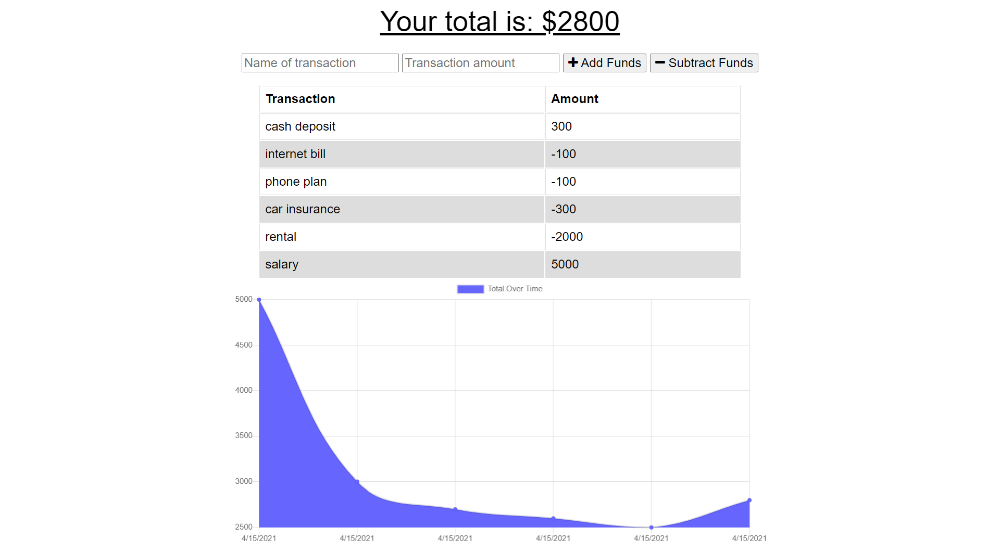

# budget-tracker

## Screenshot:

## USAGE:
- With budget-tracker, anyone will be able to track withdrawals and deposits with or without a data/internet connection and the account balance will always be accurate.
- User will get a notification when they add an expense or deposit with or without internet connection.

## DESCRIPTION:
- The deposits added while offline are added to the transaction history and totals are updated whenever internet connection re-establishes.
- Two different Cache files are created through service-worker.
- First One caches all the static files in Public folder and Second One caches the routes apis with site data.
- Offline Functionality with IndexedDb added. It will save data while offline and upload data while internet connected is re-established.

## Site:
- Link to the site: https://ryan7998-budget-tracker.herokuapp.com
